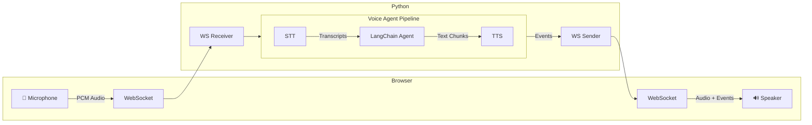

# Sim ATC 🎤✈️

Sim ATC is a scenario based training application that produces procedurelly generated scenarios for pilots to test their skills. It aims to provide realistic scenarios with the help of LLM-based voice-to-voice agents acting as different controllers such as ATIS, Ground and Tower.

## Proof of Concept
For the purpose of POC, Sim ATC will only be able to handle Melbourne Airport's Clerance Delivery and Ground Control with a hand off to Tower at the end. If this is successful and works as intended, future development will be considered.

## Notes
This is a fork of the original voic demo by LangChain but API calls external agents such as ChatGPT, Claude, Assembly AI, Elevenlabs, etc. has been replaced with local models using Ollama

## Architecture

The pipeline processes audio through three transform stages using async generators with a producer-consumer pattern:



### Pipeline Stages

Each stage is an async generator that transforms a stream of events:

1. **STT Stage** (`sttStream`): Streams audio to AssemblyAI, yields transcription events (`stt_chunk`, `stt_output`)
2. **Agent Stage** (`agentStream`): Passes upstream events through, invokes LangChain agent on final transcripts, yields agent responses (`agent_chunk`, `tool_call`, `tool_result`, `agent_end`)
3. **TTS Stage** (`ttsStream`): Passes upstream events through, sends agent text to Cartesia, yields audio events (`tts_chunk`)

## Prerequisites

- **uv** (Python package manager)

### Manual Setup

```bash
cd components/python
uv sync --dev
cd ../web
pnpm install && pnpm build
cd ../python
uv run src/main.py
```
The app will be available at `http://localhost:8000`


## Project Structure
```
services/
├── agents
│   ├── main.py                 # Main file for agents
│   ├── prompts/                # Collections of prompts for different agents
│   └── tools/                  # Agentic tools 
├── client/                     # Svelte frontend (shared by both backends)
│   └── src/
└── server/                     # Python backend
    └── src/
        ├── main.py             # Main server & pipeline
        ├── assemblyai_stt.py
        ├── cartesia_tts.py
        ├── elevenlabs_tts.py   # Alternate TTS client
        └── events.py           # Event type definitions
```
> Project structure might not be up to date.

## Event Types

The pipeline communicates via a unified event stream:

| Event | Direction | Description |
|-------|-----------|-------------|
| `stt_chunk` | STT → Client | Partial transcription (real-time feedback) |
| `stt_output` | STT → Agent | Final transcription |
| `agent_chunk` | Agent → TTS | Text chunk from agent response |
| `tool_call` | Agent → Client | Tool invocation |
| `tool_result` | Agent → Client | Tool execution result |
| `agent_end` | Agent → TTS | Signals end of agent turn |
| `tts_chunk` | TTS → Client | Audio chunk for playback |